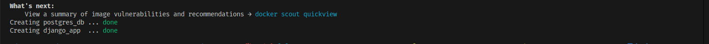
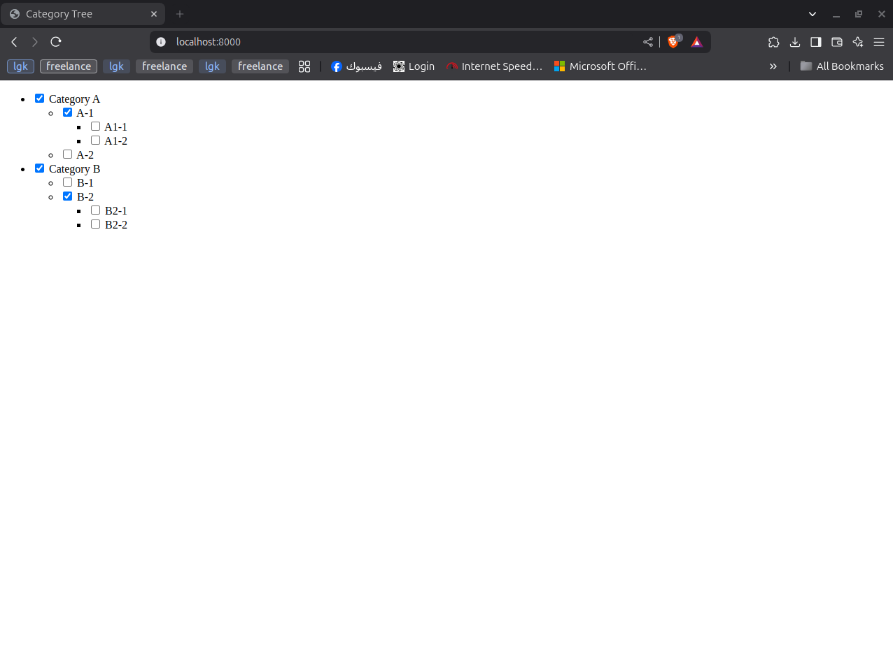
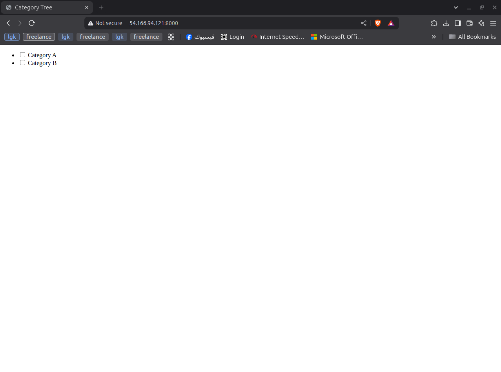

# Software Engineer Task Assessment

This role will be part of the Rightshero software development team.

As a software engineer you are a part of a small but very efficient and multi-tasking team. 

The team is tasked with handling all the software aspects of our service.

# The task
The task will be a **project** and **AWS CloudFormation** template:

## [1] The project:
A project contains one page have a 2 categories checkboxes

- [ ] Category A
- [ ] Category B

Unlimited subcategories of parent category (if it is hard to achieve the unlimited levels, you can set 3 levels hard-coded)
Should use Ajax.

### Example
- [ ] Category A
- [ ] Category B

If user select “Category B”
The system will create another 2 checkboxes with

- [ ] SUB Category B1
- [ ] SUB Category B2

Selecting Sub Category B2 will create another 2 checkboxes

- [ ] SUB SUB Category B2-1
- [ ] SUB SUB Category B2-2
 And so on


## [2] AWS CloudFormation
An AWS CloudFormation template YAML file for:
- Launch a t2.micro or t3.micro EC2 instance
- Create IAM role with admin privileges
- Attach the IAM role to the EC2 instance created earlier
- Deploy the project on the EC2 instance
- The instance should be accessable via SSH, HTTP and HTTPS protocols/ports


# Notes
- We would be scoring for the below aspects of the assignment:
- DB,Architecture /Code (preferred MVC pattern), Security, Git
- You could use a framework to create the project from scratch (Django).
- You should use MySQL or Postgresql Databases.
- Please use one table design in the database for all categories and subs.
- The code should contain comments with important information.
- README file for run the project locally.
- The **AWS CloudFormation** template file.


# Deliverables
- The project should be ready with docker compose (web service + DB).
- The **AWS CloudFormation** template YAML file.
- Once you're finished, submit a PR to this repo with your email in a commit message.
- The email should be the same as your email in the CV/Resume.

# Local Setup
## Overview
This project is a Django application containerized with Docker, using Poetry for dependency management and PostgreSQL as the database. The setup ensures a smooth deployment process and follows best practices.

## Prerequisites
Ensure you have the following installed on your system:
- Docker
- Docker Compose

## Getting Started
### Clone the Repository
```bash
git clone https://github.com/EslamRedaMohamed/category-tree
cd rightshero
```

## Start the Application with Docker
Run the following command to build and start the containers:
```bash
docker-compose up --build -d
```
This command will:
- Build the Django and PostgreSQL containers.
- Apply migrations and populate initial categories.
- Start the Django development server.

### Build Success
If the build is successful, you should see the following output:



*After a few seconds, once the build is successful, you can access the project via: [http://localhost:8000](http://localhost:8000)*




## Deploying the Project on AWS EC2  

To deploy the project on an AWS EC2 instance using CloudFormation, run the following command:  

```bash
aws cloudformation create-stack --stack-name MyEC2Stack --template-body file://cloudformation-template.yaml --capabilities CAPABILITY_NAMED_IAM
```


*Access the deployed version here: [ http://54.166.94.121:8000/]( http://54.166.94.121:8000/)*




